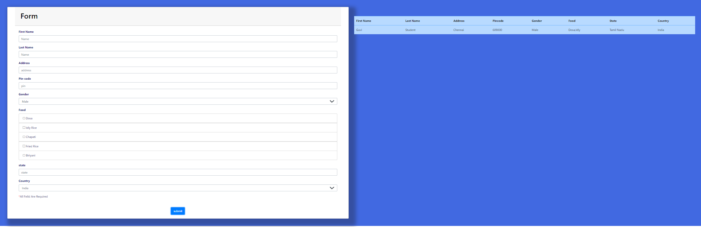

# DOM Form Task with Validations

This project is a simple web form that utilizes HTML, CSS, and JavaScript to implement client-side form validations. It demonstrates how to validate user input before submitting the form to the server.

## Features

- HTML form with input fields for First Name, Last Name, Address, Pin-code, Gender, Food, state, and Country.
- Client-side form validations using JavaScript.
- Custom error messages for each input field.
- Submit button disabled until all inputs are valid.
- Event listeners for form submission and input changes.

## Technologies Used

- HTML
- CSS
- JavaScript

## Screenshots

## Useage 
1. Fill in the form fields with the required information.
2. The form will validate the input as you type and display error messages if any.
3. Invalid input fields will be highlighted with CSS.
4. Once all input fields are valid, the submit button will be enabled.
5. Click the submit button to simulate form submission.

## License

This project is licensed under the [Guvi](https://guvi.io)