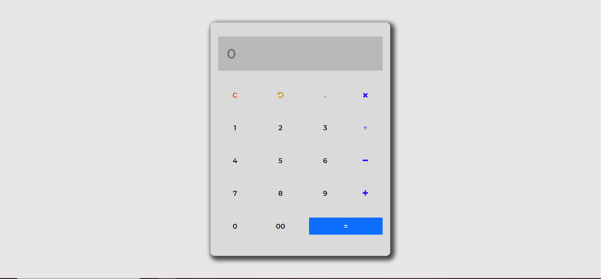

# Calculator

This is a simple calculator application built using HTML, CSS, and JavaScript. It allows users to perform basic arithmetic operations like addition, subtraction, multiplication, and division. Users can input numbers using both the calculator buttons and the keyboard.

## Features

- Addition: Allows users to add two numbers.
- Subtraction: Allows users to subtract one number from another.
- Multiplication: Allows users to multiply two numbers.
- Division: Allows users to divide one number by another.
- Keyboard Input: Users can input numbers using the keyboard.
- Number Validation: Only valid numbers can be entered.

## Technologies Used

- HTML: Markup language for creating the structure of the calculator.
- CSS: Styling language used to make the calculator visually appealing.
- JavaScript: Programming language used to add interactivity, perform calculations, and handle keyboard input.

## Usage

1. Enter the first number using the calculator buttons or the keyboard.
2. Click on the desired operation button (+, -, \*, /) or use the corresponding keyboard key.
3. Enter the second number using the calculator buttons or the keyboard.
4. Click on the equals (=) button or press the Enter key to perform the calculation.
5. The result will be displayed in the calculator's display area.

## Keyboard Input

The following keyboard keys can be used to input numbers:

- Digits 0-9: Use the corresponding keys on the keyboard to input numbers.
- Decimal Point ("."): Use the period key (.) to input decimal numbers.

## Number Validation

The calculator performs number validation to ensure only valid numbers can be entered. It prevents non-numeric characters from being inputted.

## Screenshots

## License

This project is licensed under the [Guvi](https://guvi.io)
