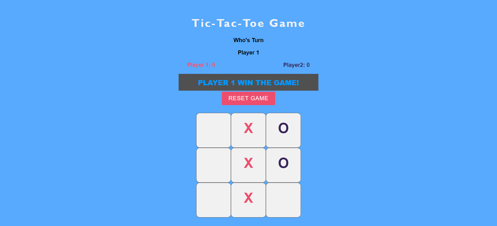

# Tic-tac-toe Game

This is a simple Tic-tac-toe game built using HTML, CSS, and JavaScript. The game allows two players to take turns marking spaces on a 3x3 grid. The objective is to get three marks in a row, either horizontally, vertically, or diagonally.

## Usage

1. Open the game in your web browser.
2. Player 1 starts the game by clicking on an empty space on the grid.
3. Player 2 takes their turn by clicking on another empty space.
4. Players continue taking turns until one player wins or the game ends in a draw.
5. To restart the game, simply refresh the page.

## Features

- Responsive design that works on desktop and mobile devices.
- Highlights the winning line when a player wins.
- Displays a message when the game ends in a draw.

## Technologies Used

- HTML
- CSS
- JavaScript

## Screenshots

## Contributing

Contributions are welcome! If you find any bugs or have suggestions for improvements, please create an issue or submit a pull request.

## License

This project is licensed under the [Guvi](https://guvi.io)
